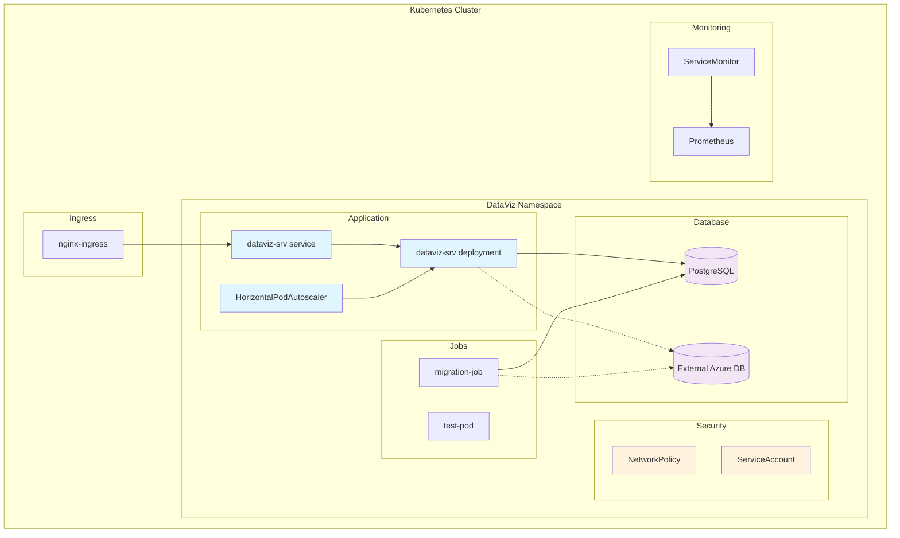
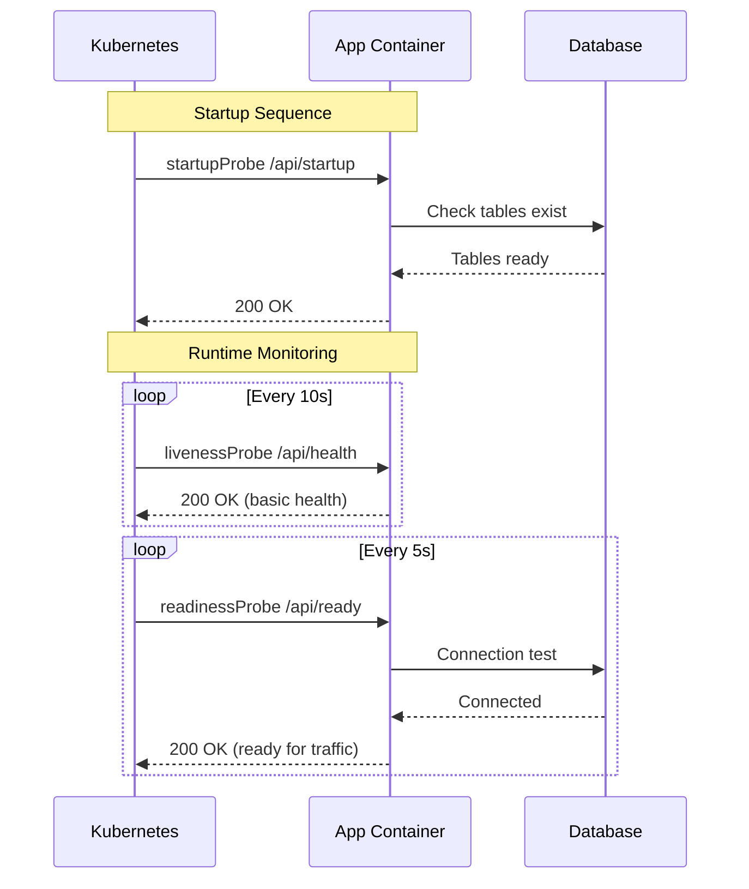

# DataViz Service Helm Chart

Production-ready Helm chart for deploying DataViz dashboard service on Kubernetes with PostgreSQL, health checks, and auto-scaling.

## Architecture



## Quick Start

```bash
# Add dependencies
helm repo add bitnami https://charts.bitnami.com/bitnami
helm repo update

# Install with internal PostgreSQL
helm upgrade --install dataviz-srv ./charts/dataviz-srv \
  --namespace dataviz \
  --create-namespace

# Test deployment
helm test dataviz-srv -n dataviz
```

## Chart Structure

```
charts/dataviz-srv/
├── Chart.yaml                    # Chart metadata
├── Chart.lock                    # Dependencies lock
├── .helmignore                   # Excluded files
├── values.yaml                   # Default configuration
├── values-dev.yaml               # Development overrides
├── values-production.yaml        # Production overrides
├── values-external-db.yaml       # External database config
├── charts/
│   └── postgresql-13.4.4.tgz    # PostgreSQL dependency
└── templates/
    ├── _helpers.tpl              # Template helpers
    ├── configmap.yaml            # Environment configuration
    ├── deployment.yaml           # Main application
    ├── service.yaml              # Service definition
    ├── ingress.yaml              # External access
    ├── secret.yaml               # Application secrets
    ├── serviceaccount.yaml       # RBAC service account
    ├── hpa.yaml                  # Horizontal Pod Autoscaler
    ├── pdb.yaml                  # Pod Disruption Budget
    ├── networkpolicy.yaml        # Network security
    ├── job-migration.yaml        # Database migration
    ├── external-db-secret.yaml   # External DB credentials
    └── test.yaml                 # Post-install tests
```

## Configuration

### Database Options

#### Internal PostgreSQL (Default)
```yaml
postgresql:
  enabled: true
  auth:
    username: dataviz
    database: dataviz
```

#### External Azure Database
```yaml
postgresql:
  enabled: false

externalDatabase:
  host: my-server.postgres.database.azure.com
  username: dataviz_user@my-server
  database: dataviz
  existingSecret: azure-postgres-credentials
```

### Environment Configuration

| Environment | File | Description |
|-------------|------|-------------|
| Development | `values-dev.yaml` | 1 replica, debug logging |
| Production | `values-production.yaml` | 3+ replicas, external DB |
| External DB | `values-external-db.yaml` | Azure PostgreSQL config |

### Health Checks



## Deployment Scenarios

### Development
```bash
helm upgrade --install dataviz-dev ./charts/dataviz-srv \
  --namespace dataviz-dev \
  --create-namespace \
  --values charts/dataviz-srv/values-dev.yaml
```

### Production with External Database
```bash
# Create secrets first
kubectl create secret generic azure-postgres-credentials \
  --from-literal=password=your-db-password \
  -n dataviz

kubectl create secret generic dataviz-secrets \
  --from-literal=JWT_SECRET=your-jwt-secret \
  --from-literal=RESEND_API_KEY=your-resend-key \
  --from-literal=OPENAI_API_KEY=your-openai-key \
  -n dataviz

# Deploy
helm upgrade --install dataviz-prod ./charts/dataviz-srv \
  --namespace dataviz \
  --create-namespace \
  --values charts/dataviz-srv/values-production.yaml \
  --values charts/dataviz-srv/values-external-db.yaml
```

## Monitoring & Observability

### Prometheus Integration
```yaml
serviceMonitor:
  enabled: true
  namespace: monitoring
```

### Available Metrics
- `dataviz_uptime_seconds` - Application uptime
- `dataviz_memory_usage_bytes` - Memory consumption
- `dataviz_database_status` - Database connectivity
- `dataviz_users_total` - Total users count
- `dataviz_charts_total` - Total charts count

### Logging
Structured JSON logging with configurable levels:
```yaml
env:
  LOG_LEVEL: info  # debug, info, warn, error
```

## Security

### Pod Security Context
```yaml
podSecurityContext:
  runAsNonRoot: true
  runAsUser: 1000
  fsGroup: 2000

securityContext:
  allowPrivilegeEscalation: false
  capabilities:
    drop: [ALL]
  readOnlyRootFilesystem: false
```

### Network Policies
```yaml
networkPolicy:
  enabled: true
  ingress:
    from:
    - namespaceSelector:
        matchLabels:
          name: ingress-nginx
  egress:
    to:
    - {} # Configurable egress rules
```

## Scaling

### Horizontal Pod Autoscaler
```yaml
autoscaling:
  enabled: true
  minReplicas: 2
  maxReplicas: 10
  targetCPUUtilizationPercentage: 70
  targetMemoryUtilizationPercentage: 80
```

### Resource Requests/Limits
| Environment | CPU Request | Memory Request | CPU Limit | Memory Limit |
|-------------|-------------|----------------|-----------|--------------|
| Development | 50m | 128Mi | 200m | 256Mi |
| Production | 300m | 512Mi | 1000m | 1Gi |

## Troubleshooting

### Common Issues

**Migration Job Fails**
```bash
kubectl logs job/dataviz-srv-migration -n dataviz
# Check database connectivity and credentials
```

**App Not Ready**
```bash
kubectl logs deployment/dataviz-srv -n dataviz
curl -f http://localhost:3003/api/ready  # via port-forward
```

**Health Check Failures**
```bash
kubectl describe pod <pod-name> -n dataviz
# Check health endpoint responses
```

### Useful Commands
```bash
# Check deployment status
helm status dataviz-srv -n dataviz

# View application logs
kubectl logs -f deployment/dataviz-srv -n dataviz

# Run tests
helm test dataviz-srv -n dataviz

# Port forward for local testing
kubectl port-forward service/dataviz-srv 3003:3003 -n dataviz

# Check HPA status
kubectl get hpa -n dataviz

# View network policies
kubectl get networkpolicy -n dataviz
```

## Backup & Recovery

### Database Backup
```yaml
postgresql:
  backup:
    enabled: true
    schedule: "0 2 * * *"  # Daily at 2 AM
```

### Manual Backup
```bash
kubectl exec -it statefulset/dataviz-srv-postgresql -n dataviz -- \
  pg_dump -U dataviz dataviz > backup-$(date +%Y%m%d).sql
```

## Upgrading

### Application Updates
```bash
helm upgrade dataviz-srv ./charts/dataviz-srv \
  --namespace dataviz \
  --set image.tag=v1.2.0
```

### Chart Dependencies
```bash
helm dependency update charts/dataviz-srv
```

## Values Reference

| Parameter | Description | Default |
|-----------|-------------|---------|
| `image.repository` | Container image repository | `ghcr.io/teamdigitale/dataviz-srv` |
| `image.tag` | Container image tag | `main` |
| `replicaCount` | Number of replicas | `2` |
| `postgresql.enabled` | Enable internal PostgreSQL | `true` |
| `externalDatabase.host` | External database host | `""` |
| `ingress.enabled` | Enable ingress | `true` |
| `autoscaling.enabled` | Enable HPA | `true` |
| `networkPolicy.enabled` | Enable network policies | `true` |
| `serviceMonitor.enabled` | Enable Prometheus monitoring | `false` |

For complete values reference, see [values.yaml](values.yaml).

## Contributing

1. Test changes with `helm template` and `helm lint`
2. Update version in `Chart.yaml`
3. Run `helm dependency update` if dependencies changed
4. Commit with conventional commit format